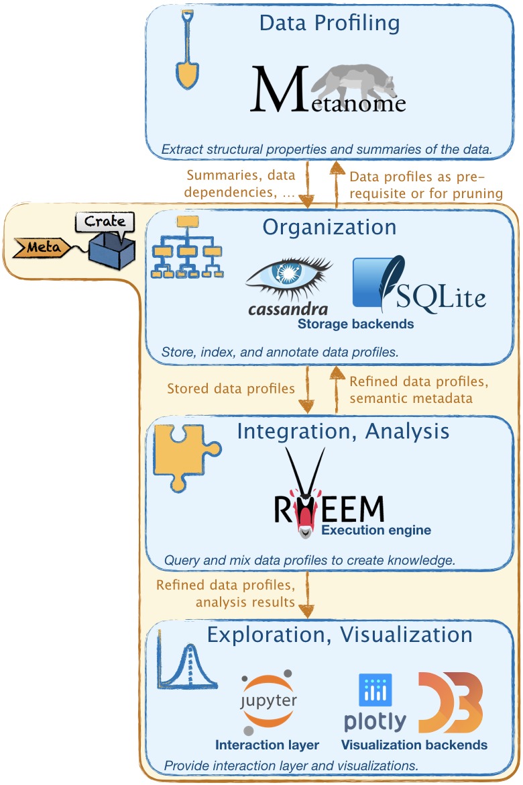
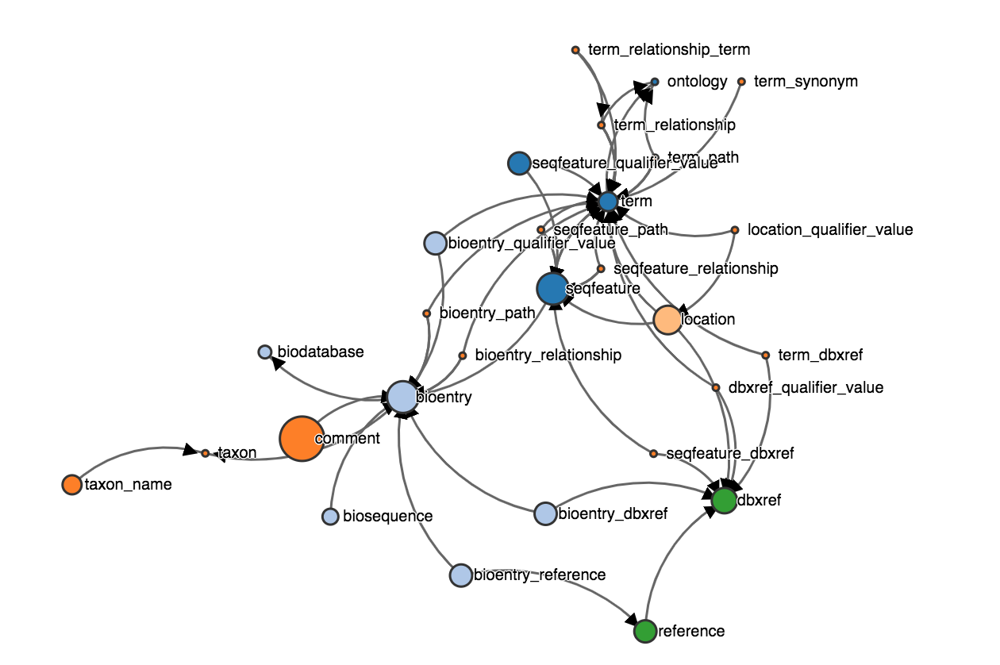

# Metacrate

**Status:** [](https://travis-ci.org/stratosphere/metadata-ms)



*This file is mostly a technical documentation of Metacrate. For more high-level artifacts and information on this project, its goals, context etc. please visit our [web page](https://hpi.de/naumann/projects/data-profiling-and-analytics/metacrate.html)*.

Data profiles of relational datasets (e.g., summaries and data dependencies) are useful for data-oriented tasks, such as query processing, data mining, and data integration. Data profiling techniques (as for instance provided by [Metanome](http://www.metanome.de)) determine such metadata for a given dataset. However, once the metadata have been acquired, they need to be further processed. In particular, it is highly beneficial to integrate and combine the different types of metadata and allow to explore them interactively.

This is where Metacrate comes into play. It allows to store metadata in various persistence layers (Java serialization, SQLite, and Cassandra), thereby integrating the different types of metadata. Moreover, Metacrate complements this persistence layer with an analytical layer that exposes a query API along with an analytics library that allows to refine the data profiles and derive valuable insights.

## Usage notes

There are multiple ways to use Metacrate, e.g., as a library, in [Jupyter](https://jupyter.org/) notebooks, or from the command line. In the following, we explain the latter two (while recommending to use Jupyter notebook).

### Metacrate & Jupyter notebooks

Metacrate provides an API that integrates with Jupyter notebooks, thereby allowing to explore and analyze data profiles in an interactive fashion.
Below, we explain how to set up Jupyter and how to use Metacrate from it.

**Installation.**  At first, you need to [install Jupyter](https://jupyter.org/install.html) (formerly IPython).
Next, you need to install the [Jupyter-Scala kernel](http://jupyter-scala.org/). Specifically, we have successfully used the version `0.4.2` with Scala version `2.11`. Finally, if you want to use a snapshot version of Metacrate, you can build it with [Apache Maven](https://maven.apache.org/). Just go to the folder `mdms` and executed `mvn install`.

**Getting started.**
To get started using Metacrate, have a look at our [example notebooks](https://hpi.de/naumann/projects/data-profiling-and-analytics/metacrate.html) for runnable examples.
Here, we will go through only the most important steps. At first, you need to tell the Jupyter-Scala kernel to load Metacrate. If you are using a snapshot version (which you have built yourself), you will also need to tell to load it from your local Maven repository:
```scala
locally {
    val m2Resolver = ammonite.runtime.tools.Resolver.File(
        "m2", "/.m2/repository", ammonite.runtime.tools.Resolvers.MavenPattern, true
    )
    interp.resolvers.update(interp.resolvers() ++ Seq(m2Resolver))
}
```
Then run:
```scala
// Import required libs into the notebook.
import $ivy.`de.hpi.isg:mdms-jupyter:0.0.3-SNAPSHOT`,
	   $ivy.`de.hpi.isg:mdms-tools:0.0.3-SNAPSHOT`,
	   $ivy.`de.hpi.isg:mdms-analytics:0.0.3-SNAPSHOT`

// Import the packages.
import de.hpi.isg.mdms.jupyter._
import de.hpi.isg.mdms.analytics._
import de.hpi.isg.mdms.tools._
import de.hpi.isg.mdms.domain.constraints._
import de.hpi.isg.mdms.model.constraints._
import org.qcri.rheem.api._, org.qcri.rheem.core.api._, org.qcri.rheem.java._
import scala.collection.JavaConversions._
```
In the next step, create a new Metacrate instance and initialize the query engine:
```scala
implicit var metacrate =  createMetacrate(storageBackend = StorageBackend(location = "metacrate.db"))
implicit val rheemCtx = new RheemContext() withPlugin Java.basicPlugin
```
Now, you can populate your instance with schema information and data profiles. For that purpose, have a look at the class `de.hpi.isg.mdms.tools.Import`. For instance:
```scala
Import.createSchemaFromSqlFile(...)
Import.importMetanomeStatistics(...)
Import.importMetanomeDependencies[...](...)
```
Eventually, you can start exploring your dataset via its data profiles. To initiate a new query, use statments of the form `query { implicit engine => ... }`.
For instance, this query combines previously created table importances and a table clustering into a schema graph:
```scala
locally {
    val vertices = query { implicit engine =>
        val importances = metacrate.loadConstraints[TableImportance]("table-importances")
        val clustering = metacrate.loadConstraints[TableClusterAssignment]("table-cluster-k5")
        
        importances.keyBy(_.tableId).join(clustering.keyBy(_.tableId))
            .assemble { (imp, clust) => (imp.tableId, imp.score, clust.clusterId) }
            .resolveTableIds(_._1, { case (data, table) => 
                GraphVertex(name = table.name,
                            size = (math.max(2, math.sqrt(data._2))).toInt,
                            color = data._3
                )
            })
    }

    val idUtils = metacrate.getIdUtils
    val foreignKeys = query { implicit engine =>
        metacrate.loadConstraints[InclusionDependency]("sql-foreign-keys")
            .map { case ind => (idUtils.getTableId(ind.getDependentColumnIds()(0)), 
                                idUtils.getTableId(ind.getReferencedColumnIds()(0))) }
            .resolveTableIds(_._1, {case (link, table) => (table.name, link._2)})
            .resolveTableIds(_._2, {case (link, table) => GraphEdge(link._1, table.name)})
    }
    
    foreignKeys.plotDirectedGraph(nodes = vertices,
                                  height = "600px",
                                  charge = -1000,
                                  linkDistance = 200)
}
```
This gives an output similar to this:

For further details, have a look at our [example notebooks](https://hpi.de/naumann/projects/data-profiling-and-analytics/metacrate.html).

### Metacrate & the command line

Besides providing a library for metadata management, the Metacrate provides a set of utilities that can be run from the command line and allow for the management of metadata stores. Note that all tools can be run without parameters to explain their usage.

**Create a metadata store.** Creating and initializing a metadata store is the first step. This metadata store can later on manage metadata. To create a new metadata store, run the main class `de.hpi.isg.mdms.tools.apps.CreateMetadataStoreApp`.

**Import a database schema.** We provide a tool to automatically extract the basic schema information (tables, columns) of a database that is represented by CSV files. Importing such a schema is necessary (i) to configure data profiling algorithms appropriately, e.g., to define a set of schema elements to be profiled, and (ii) to integrate various metadata types by having them referencing the imported schema elements. To import a schema from a set of CSV files, run the main class `de.hpi.isg.mdms.tools.apps.CreateSchemaForCsvFilesApp`.

**Fill the metadata store.** To extract metadata from databases is the task of data profiling tools. This issue is orthogonal to the goals of the Metacrate, which aims at managing metadata but not their discovery. While in general the Metacrate offers APIs to interact with data profiling algorithms, we also provide a tool to import metadata from the [Metanome](http://www.metanome.de) data profiling tool. To do so, run the main classes `de.hpi.isg.mdms.tools.apps.MetanomeDependencyImportApp` (for functional dependencies, inclusion dependencies, and unique column combinations) and `de.hpi.isg.mdms.tools.apps.MetanomeStatisticsImportApp` (for column statistics).

**Analyze metadata.** This phase is currently in development. Some preview functionality can be found in the main classes `de.hpi.isg.mdms.java.apps.PrimaryKeyClassifier` and `de.hpi.isg.mdms.java.apps.ForeignKeyClassifier` (for PK and FK classification) and `de.hpi.isg.mdms.flink.apps.KmeansUccsApp` and `de.hpi.isg.mdms.flink.apps.AprioriUccsApp` (for data mining on unique column combinations).

**Use a client.** The Metacrate currently offers two interfaces. The first one is a CLI and offers all of the above described functionality. Just run the main class `de.hpi.isg.mdms.cli.apps.MDMSCliApp`. Moreover, this CLI can also be used via [Apache Zeppelin](https://zeppelin.incubator.apache.org/). Check out [metadata-ms-on-zeppelin](https://github.com/stratosphere/metadata-ms-on-zeppelin).

## Project overview

* Base modules
  * `mdms-model`: metamodel of relational schemata
  * `mdms-dependencies`: metamodel of most common dependencies (e.g., inclusion dependencies and functional dependencies)
  * `mdms-util`: general-purpose utilities used throughout the project
* Persistence modules
  * `mdms-simple`: persistence using Java serialization
  * `mdms-rdmbs`: abstract persistence module for relational databases
  * `mdms-sqlite`: presistence with SQLite
  * `mdms-cassandra`: persistence with Cassandra
* Application modules
  * `mdms-jupyter`: Integration of Metacrate with Jupyter notebooks
  * `mdms-analytics`: (Scala-based) analytics library for data profiles
  * `mdms-clients`: utilities to write Metacrate-based applications
  * `mdms-tools`: basic Metacrate applications, such as importing a schema from CSV files into a metadata store
  * `mdms-java`: Java-based utilities for Metacrate applications
  * `mdms-flink`: Flink-based utilites for Metacrate applications (complementary to `mdms-java`)
  * `mdms-cli`: CLI-based client to operate the metadata store

  ## License

  Unless explicitly stated otherwise all files in this repository are licensed under the Apache Software License 2.0

  Copyright 2014-217 Sebastian Kruse

  Licensed under the Apache License, Version 2.0 (the "License");
  you may not use this file except in compliance with the License.
  You may obtain a copy of the License at

      http://www.apache.org/licenses/LICENSE-2.0

  Unless required by applicable law or agreed to in writing, software
  distributed under the License is distributed on an "AS IS" BASIS,
  WITHOUT WARRANTIES OR CONDITIONS OF ANY KIND, either express or implied.
  See the License for the specific language governing permissions and
  limitations under the License.
